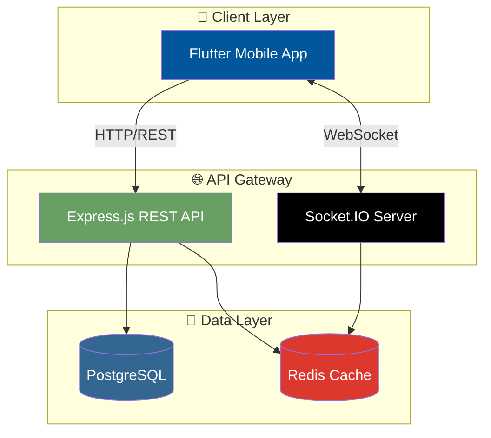
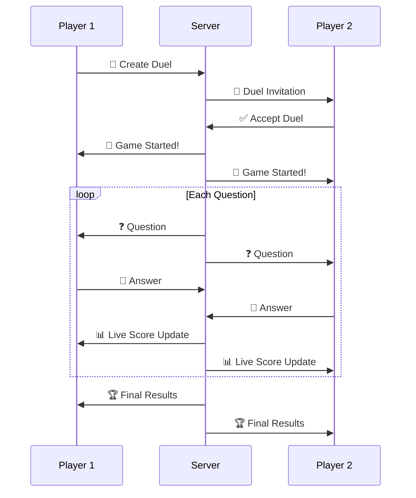

<div align="center">

# ⚔️ LearnDuels

### 🎮 The Ultimate Real-Time Multiplayer Quiz Battle Platform

[](https://choosealicense.com/licenses/mit/)
[](https://nodejs.org/)
[](https://flutter.dev/)
[](https://www.postgresql.org/)
[](https://redis.io/)
[](https://socket.io/)

<br/>

> 🚀 **Challenge friends. Climb leaderboards. Master knowledge.** 🚀

*Transform boring study sessions into exciting 1v1 quiz battles!*

<br/>

---

</div>

## 🌟 What is LearnDuels?

**LearnDuels** is a gamified learning platform where knowledge meets competition. Challenge your friends or random opponents to real-time quiz duels across various subjects — from Mathematics to History, Science to Pop Culture.

<div align="center">

| 🎯 **Challenge** | ⚡ **Compete** | 🏆 **Conquer** |
|:---:|:---:|:---:|
| Send duel invites to friends | Answer questions in real-time | Rise up the global leaderboards |

</div>

---

## ✨ Features

<table>
<tr>
<td width="50%">

### ⚔️ Real-Time 1v1 Duels
Battle head-to-head with live score updates. Feel the adrenaline as you race against your opponent!

### 🎯 Practice Mode
Sharpen your skills solo before challenging others. Track your progress and identify weak areas.

### 👥 Friend Challenges
Send direct challenges to friends. Prove who's the ultimate knowledge champion!

</td>
<td width="50%">

### 🏆 Global Leaderboards
Compete for the top spot on global, regional, and friend rankings. Earn your bragging rights!

### 📚 Multiple Categories
Choose from 10+ subjects including Math, Science, History, Geography, and more!

### 🔔 Push Notifications
Never miss a challenge! Get instant alerts for invites, results, and friend activities.

</td>
</tr>
</table>

---

## 🏗️ Architecture



---

## 🛠️ Tech Stack

<div align="center">

| Layer | Technology |
|:---:|:---:|
| **Frontend** | Flutter • Dart • Provider • Dio • Socket.IO Client |
| **Backend** | Node.js • Express.js • Socket.IO • JWT • Passport.js |
| **Database** | PostgreSQL • Prisma ORM • Redis |
| **DevOps** | Docker • Docker Compose |

</div>

---

## 🚀 Quick Start

### Prerequisites

- **Node.js** v18+
- **Flutter** 3.0+
- **PostgreSQL** 14+
- **Redis** (optional, for caching)

### 1️⃣ Clone the Repository

```bash
git clone https://github.com/yourusername/learnDuels.git
cd learnDuels
```

### 2️⃣ Backend Setup

```bash
cd backend

# Install dependencies
npm install

# Setup environment
cp .env.example .env
# Edit .env with your database credentials

# Run database migrations
npx prisma migrate dev
npx prisma generate

# Start the server
npm run dev
```

> 🌐 Backend runs on `http://localhost:4000`

### 3️⃣ Frontend Setup

```bash
cd frontend

# Get Flutter packages
flutter pub get

# Run on your device/emulator
flutter run
```

### 🐳 Docker (Recommended)

```bash
# Start everything with one command
docker-compose up -d

# That's it! 🎉
```

---

## 📁 Project Structure

```
📦 learnDuels
├── 📂 backend/              # Node.js API Server
│   ├── 📂 src/
│   │   ├── 📂 controllers/  # Route handlers
│   │   ├── 📂 services/     # Business logic
│   │   ├── 📂 sockets/      # WebSocket handlers
│   │   └── 📂 middlewares/  # Auth, validation
│   └── 📂 prisma/           # Database schema
│
├── 📂 frontend/             # Flutter Mobile App
│   └── 📂 lib/
│       ├── 📂 screens/      # UI screens
│       ├── 📂 widgets/      # Reusable components
│       └── 📂 core/         # Services & utilities
│
└── 📜 docker-compose.yml    # Container orchestration
```

---

## 🎮 How It Works



---

## 🤝 Contributing

Contributions are always welcome! Here's how you can help:

1. 🍴 **Fork** the repository
2. 🌿 Create a **feature branch** (`git checkout -b feature/amazing-feature`)
3. 💾 **Commit** your changes (`git commit -m 'Add amazing feature'`)
4. 📤 **Push** to the branch (`git push origin feature/amazing-feature`)
5. 🔃 Open a **Pull Request**

---

## 📄 License

This project is licensed under the **MIT License** - see the [LICENSE](LICENSE) file for details.

---

<div align="center">

### 💖 Made with Love by the LearnDuels Team

**⭐ Star this repo if you find it helpful! ⭐**

[Report Bug](../../issues) · [Request Feature](../../issues)

</div>
