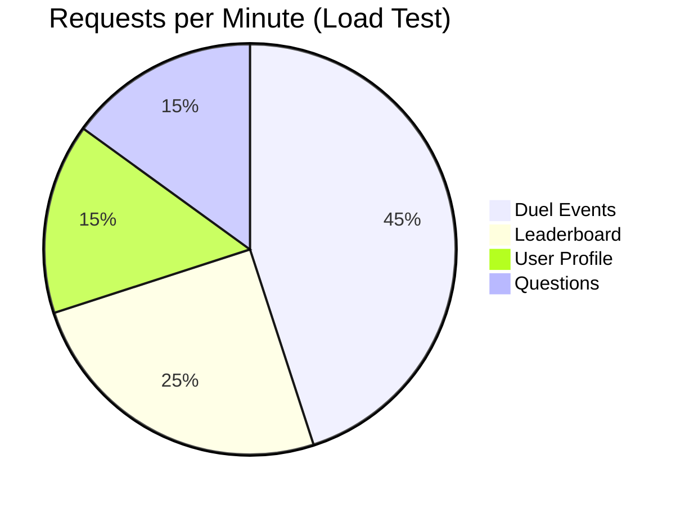

# ⚔️ LearnDuels
> **The Ultimate Real-Time Multiplayer Learning Platform**


**LearnDuels** is a cutting-edge educational platform that gamifies learning through real-time 1v1 battles. Challenge friends, climb the global leaderboards, and master subjects from Mathematics to History in high-stakes knowledge duels.

---

## 🏗️ System Architecture

Our platform is built for speed and scalability, handling thousands of concurrent users with sub-millisecond latency.

```mermaid
graph TD
    User([👤 User]) -->|Mobile App| Client[📱 Flutter Frontend]
    
    subgraph Cloud Infrastructure
        Client -->|HTTP REST| ALB[⚖️ Load Balancer]
        Client -->|WebSocket| Socket[⚡ Socket.IO Cluster]
        
        ALB -->|Route| API[🚀 Node.js Backend API]
        Socket -->|Events| API
        
        API -->|Query| DB[(🐘 PostgreSQL Primary)]
        API -->|Cache| Redis[(🔴 Redis Cache)]
        
        Redis -.->|Session Data| Socket
    end
    
    style User fill:#f9f,stroke:#333
    style Client fill:#61dafb,stroke:#333
    style API fill:#68a063,stroke:#333,,color:white
    style DB fill:#336791,stroke:#333,color:white
    style Redis fill:#d82c20,stroke:#333,color:white
```

---

## ⚡ Key Features

| Feature | Description | Tech Stack |
|---------|-------------|------------|
| **⚔️ 1v1 Duels** | Real-time quiz battles with live score updates | Socket.IO, Redis |
| **🏆 Leaderboards** | Global, regional, and friend rankings | PostgreSQL, Redis Sorted Sets |
| **🔔 Push Notifications** | Instant alerts for challenges and results | Firebase, Socket.IO |
| **📊 Analytics** | Detailed performance tracking and history | Chart.js (Frontend) |
| **🔐 Secure Auth** | JWT-based authentication with refresh capability | Passport.js, JWT |

---

## 📂 Repository Structure

The project is divided into two main components:

```bash
📦 learnDules
 ┣ 📂 backend       # Node.js + Express + Prisma API
 ┃ ┣ 📜 README.md   # Detailed Backend Documentation
 ┃ ┗ 📜 API_DOCS.md # API Endpoint Reference
 ┣ 📂 frontend      # Flutter Cross-Platform App
 ┃ ┗ 📜 lib/        # Dart Source Code
 ┗ 📜 README.md     # You are here
```

> **👉 Note:** Each folder contains its own detailed `README.md` for specific setup instructions.

---

## 🚀 Quick Start Guide

Get the entire system running on your local machine in minutes.

### 1. Backend Setup

```bash
cd backend

# Install dependencies
npm install

# Setup Database
npx prisma migrate dev
npx prisma generate

# Start Server
npm run dev
```
*Server runs on `http://localhost:4000`*

### 2. Frontend Setup

```bash
cd frontend

# Get Flutter packages
flutter pub get

# Run App
flutter run
```

---

## 🛠️ Technology Stack

### Frontend (Mobile)
- **Framework**: Flutter (Dart)
- **State Management**: Provider
- **Networking**: Dio
- **Real-time**: socket_io_client

### Backend (Server)
- **Runtime**: Node.js
- **Framework**: Express.js
- **Database**: PostgreSQL (Prisma ORM)
- **Caching**: Redis
- **Real-time**: Socket.IO

---

## 📈 Performance Metrics



---

## 🤝 Contributing

We welcome contributions! Please follow these steps:

1. Fork the repository
2. Create your feature branch (`git checkout -b feature/AmazingFeature`)
3. Commit your changes (`git commit -m 'Add some AmazingFeature'`)
4. Push to the branch (`git push origin feature/AmazingFeature`)
5. Open a Pull Request

---

<p align="center">
  Built with ❤️ by the LearnDuels Team
</p>
